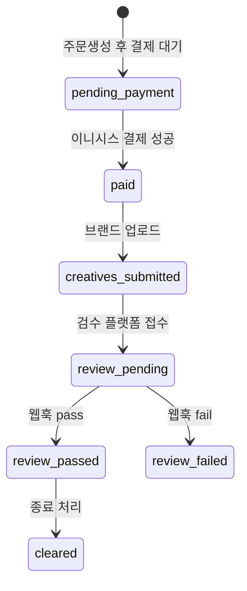

# CPM 라인 검수 API 계약 초안

검수 SaaS(통합 플랜의 **플랫폼 2번**)가 brand-slam CPM 라인과 연동할 때 사용하는 진입점과 페이로드 규격입니다.

## 웹훅 엔드포인트

- **URL**: `POST https://<배포-호스트>/api/cpm/review-webhook`
- **인증 (택 1)**  
  - 헤더: `x-cpm-review-secret: <CPMS_REVIEW_WEBHOOK_SECRET>`  
  - 또는 헤더: `Authorization: Bearer <CPMS_REVIEW_WEBHOOK_SECRET>`  

Vercel 프로젝트 환경 변수 `CPMS_REVIEW_WEBHOOK_SECRET` 과 검수 측이 동일한 값을 공유해야 합니다. 본문 `secret` 필드로도 허용되나, 로그 노출 가능성 때문에 헤더 사용을 권장합니다.

## 요청 바디 필드

| 필드 | 필수 | 설명 |
|------|------|------|
| `order_number` | 예 | 브랜드슬램 `cpm_orders.order_number`. `CPM-` 접두어. |
| `next_status` | 조건부 | 허용: `review_passed`, `review_failed`, `review_pending`, `cleared`. 제공 시 이 값을 우선합니다. |
| `result` / `verdict` | 조건부 | 문자열 또는 객체. 패스·페일 키워드로 상태를 추론할 때 사용합니다. |
| `correlation_id` | 선택 | 멱등·재시도 매칭용 ID |
| `message` 또는 `reason` | 선택 | `cpm_orders.reviewer_note` 에 반영 |
| `creative_urls` | 선택 | 크리에이티브 참조 목록(검수 측이 유지하면 됨 — MVP 저장은 선택) |

## 응답

- 성공 시: `{ "ok": true, "order_number": "...", "status": "<next>" }`
- 검수 결과는 추가로 `cpm_review_hooks` 테이블에 `payload` JSON으로 감사 로그 형태 적재합니다.

## `cpm_orders` 상태머신 (권장)

MVP에서는 **결제 후 `paid`**까지 자동 처리되고, 이후 상태는 검수 플랫폼 또는 내부 관리 도구에서 `creatives_submitted` → `review_pending` 진입 후 웹훅으로 업데이트하는 흐름을 권장합니다.

## 크로스 참조

- DB 스키마: 저장소 루트 `supabase-cpm-migration.sql`
- 검수 진입 코드: [`api/cpm/review-webhook.js`](../api/cpm/review-webhook.js)
